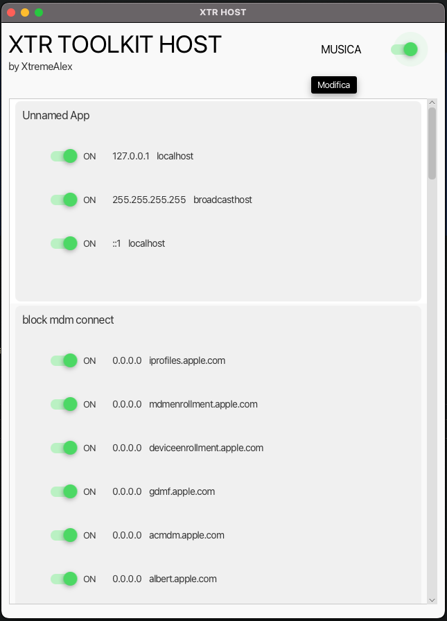
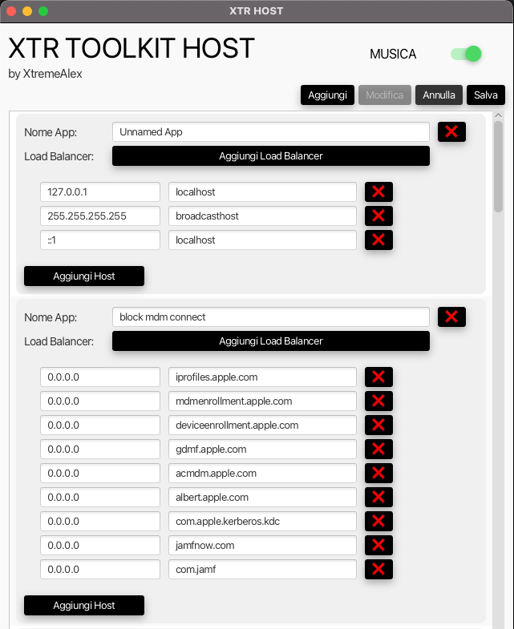

<a name="readme-top"></a>

<!-- PROJECT LOGO -->
<br />
<div align="center">
  <a href="">
    
    
  </a>

  <h3 align="center">XTR-TOOLKIT-HOSTS</h3>

  <p align="center">
   **xtr-toolkit-hosts** è un servizio dedicato alla modifica del file di host in caso si lavori con multipli host.
    <br />
    <a href="https://github.com/XtremeAlex/xtr-toolkit-hosts"><strong>Explore the docs »</strong></a>
    <br />
    <br />
    <a href=""></a>
    ·
    <a href="/issues">Report Bug</a>
    ·
    <a href="/issues">Request Feature</a>
  </p>
</div>


<!-- ABOUT THE PROJECT -->
## Info sul progetto

Durante il poco tempo che riesco a strappare al lavoro e agli altri impegni, mi diverto a sperimentare con tecnologie e nuovi framework, e questa ne è una piccola dimostrazione.
Questo è solo uno dei numerosi moduli che prevedo di rilasciare, con l'intento di condividerli e arricchirli attraverso il contributo della community.


### Invito alla Collaborazione
Il contributo di idee, codice e feedback è sempre benvenuto e incoraggiato per diversi motivi:
* Sperimentare con Nuove Tecnologie
  * Questo progetto mette alla prova le proprie competenze in un contesto realistico.
* Crescita Collettiva
  * Collaborando, possiamo imparare gli uni dagli altri, scambiare idee e crescere professionalmente insieme.
* Base per Sviluppi Futuri
  * Il progetto è strutturato seguendo le best practice, rendendolo un ottimo punto di partenza per i tuoi sviluppi futuri.
  * L'approccio "Enterprise Like" garantisce che le soluzione sia di alta qualità e pronta per l'uso in contesti aziendali.

Grazie a tutti quelli che hanno o vorranno contribuire ad espandere qusto progetto.

<p align="right">(<a href="#readme-top">back to top</a>)</p>


<!-- GETTING STARTED -->
## Getting Started
Questo progetto è configurato per usare Maven per la gestione delle dipendenze e la compilazione.
È sviluppato con Spring 3 e Java 17 e può essere facilmente avviato e testato in un ambiente locale.

### Prerequisiti
Per utilizzare e contribuire a questo progetto, avrai bisogno di installare:
- Git (2.43.0)
- Java OJDK (Graal Versione 17)
- Maven (Apache Maven 3.9.6)
- JAVAFX 21

**Contenent**

```
.
├── pom.xml
└── src
    ├── main
    │   ├── java
    │   │   └── com
    │   │       └── xtremealex
    │   │           └── toolkit
    │   │               └── hosts
    │   │                   ├── IOHostParser.java
    │   │                   ├── MainHostsApp.java
    │   │                   ├── models
    │   │                   │   ├── App.java
    │   │                   │   ├── Host.java
    │   │                   │   └── HostType.java
    │   │                   └── mvp
    │   │                       ├── MusicPlayer.java
    │   │                       ├── controllers
    │   │                       │   ├── AppCell.java
    │   │                       │   ├── HostEditCell.java
    │   │                       │   ├── HostListCell.java
    │   │                       │   ├── IMainViewController.java
    │   │                       │   ├── ModalController.java
    │   │                       │   └── impl
    │   │                       │       └── MainViewControllerImpl.java
    │   │                       └── views
    │   │                           └── presenter
    │   │                               ├── IMainPresenter.java
    │   │                               └── impl
    │   │                                   └── MainPresenterImpl.java
    │   └── resources
    │       ├── css
    │       │   └── styles.css
    │       ├── fonts
    │       │   ├── Comfortaa
    │       │   │   ├── Comfortaa-Bold.ttf
    │       │   │   ├── Comfortaa-Light.ttf
    │       │   │   ├── Comfortaa-Medium.ttf
    │       │   │   ├── Comfortaa-Regular.ttf
    │       │   │   ├── Comfortaa-SemiBold.ttf
    │       │   │   └── Comfortaa.css
    │       │   ├── Fonts.css
    │       │   ├── OpenSans
    │       │   │   ├── OpenSans-Bold.ttf
    │       │   │   ├── OpenSans-BoldItalic.ttf
    │       │   │   ├── OpenSans-ExtraBold.ttf
    │       │   │   ├── OpenSans-ExtraBoldItalic.ttf
    │       │   │   ├── OpenSans-Italic.ttf
    │       │   │   ├── OpenSans-Light.ttf
    │       │   │   ├── OpenSans-LightItalic.ttf
    │       │   │   ├── OpenSans-Regular.ttf
    │       │   │   ├── OpenSans-SemiBold.ttf
    │       │   │   ├── OpenSans-SemiBoldItalic.ttf
    │       │   │   └── OpenSans.css
    │       │   ├── Overpass
    │       │   │   ├── Overpass-Light.ttf
    │       │   │   ├── Overpass-Regular.ttf
    │       │   │   └── Overpass-VariableFont_wght.ttf
    │       │   └── Roboto
    │       │       ├── Roboto-Black.ttf
    │       │       ├── Roboto-BlackItalic.ttf
    │       │       ├── Roboto-Bold.ttf
    │       │       ├── Roboto-BoldItalic.ttf
    │       │       ├── Roboto-Italic.ttf
    │       │       ├── Roboto-Light.ttf
    │       │       ├── Roboto-LightItalic.ttf
    │       │       ├── Roboto-Medium.ttf
    │       │       ├── Roboto-MediumItalic.ttf
    │       │       ├── Roboto-Regular.ttf
    │       │       ├── Roboto-Thin.ttf
    │       │       ├── Roboto-ThinItalic.ttf
    │       │       ├── Roboto.css
    │       │       └── RobotoMono-VariableFont_wght.ttf
    │       ├── fxml
    │       │   └── MainView.fxml
    │       ├── images
    │       └── music
    │           └── background.wav
    └── test
        └── java

```

### Compilazione

**Clonare il Repository**

1. Per iniziare, clona il repository `xtr-toolkit-hosts` sul tuo computer locale usando Git.
   Apri il terminale e esegui il seguente comando:
   ```
   git clone https://<repository>/xtr-toolkit-hosts.git cd
   xtr-toolkit-hosts
   ```

2. Una volta clonato il repository, puoi compilare il progetto utilizzando Maven.
   Esegui il seguente comando nella directory radice del progetto:
   ```
   mvn clean package jpackage:jpackage -Pmac-aarch64  OR mvn clean package jpackage:jpackage -Pwindows
   ```
   

3. Ora puoi avviarlo eseguendo:
   ```
   java -jar ./target/jpackage si troverà l'eseguibile
   
   RICORDARSI DI INSERIRE LA STRINGA : ##start-xtr-toolkit-host che sta ad indicare il punto da cui iniziare a leggere
   ```
   
<!-- ROADMAP -->
## Roadmap
- [ ] Testare il tutto riportando 

Consulta [open issues](https://github.com/XtremeAlex/xtr-toolkit-hosts/issues) per una lista completa delle funzionalità proposte (bug e feature).
s
<p align="right">(<a href="#readme-top">back to top</a>)</p>


<!-- CONTRIBUTING -->
## Aiutami

L'aiuto di tutti rende la comunità open source un luogo incredibile per imparare, ispirarsi e creare.
Qualsiasi contributo tu possa fornire è **enormemente apprezzato**.

Se hai un suggerimento che potrebbe migliorare questo progetto, per favore effettua un fork del repository e crea una pull request.
Puoi anche semplicemente aprire un problema con il tag "bug".

Non dimenticare di mettere una stella al progetto!
Grazie ancora!


## Contributing

Contributions are what make the open source community such an amazing place to learn, inspire, and create.
Any contributions you make are **greatly appreciated**.

If you have a suggestion that would make this better, please fork the repo and create a pull request. You can also simply open an issue with the tag "bug".

Don't forget to give the project a star!
Thanks again!

## Git Command

1. Fork the Project
2. Create your Feature Branch (`git checkout -b feature/SexToysFeature`)
3. Commit your Changes (`git commit -m 'Add some SexToysFeature'`)
4. Push to the Branch (`git push origin feature/SexToysFeature`)
5. Open a Pull Request

<p align="right">(<a href="#readme-top">back to top</a>)</p>


<!-- LICENSE -->
## License

Distributed under the Apache License. See `LICENSE` for more information.

<p align="right">(<a href="#readme-top">back to top</a>)</p>


<!-- CONTACT -->
## Contact

Andrei Alexandru Dabija - [@linkedin](https://www.linkedin.com/in/andrei-alexandru-dabija/) - /andrei-alexandru-dabija

GitHub Link: [https://github.com/XtremeAlex](https://github.com/XtremeAlex)

<p align="right">(<a href="#readme-top">back to top</a>)</p>

