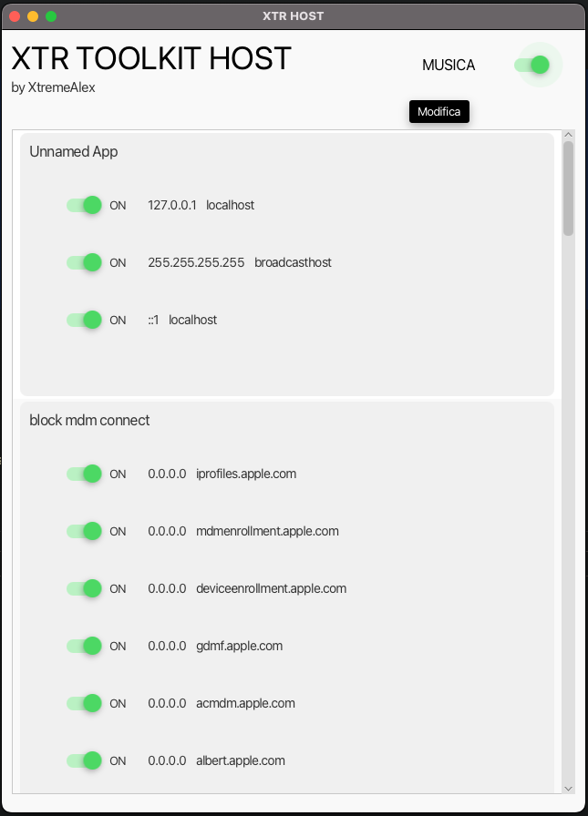
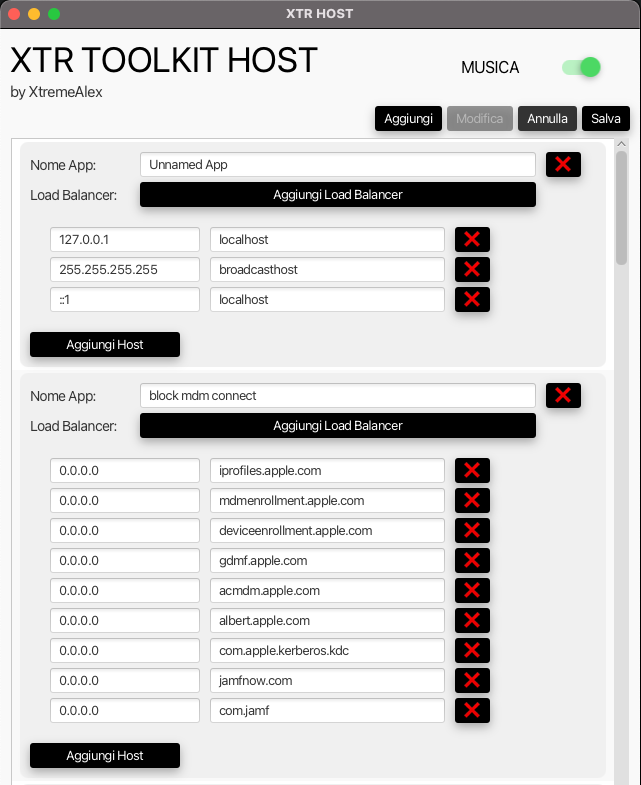

<a name="readme-top"></a>

<div align="center">
  
  
</div>

# xtr-toolkit-hosts

Applicazione desktop JavaFX per gestire e modificare il file `hosts` quando si lavora con molteplici host e ambienti.

## Info sul progetto

Questo progetto nasce come piattaforma sperimentale personale per mettere alla prova tecnologie e framework moderni in un contesto realistico. Semplifica la modifica del file `hosts` raggruppando gli host per applicazione/ambiente tramite un'interfaccia grafica.

È uno dei moduli di una serie più ampia, pensata per essere condivisa e arricchita con il contributo della community.

## Stack tecnologico

- Java 17
- JavaFX 21
- Maven (jpackage)
- Linux, macOS, Windows

## Getting Started

Il progetto usa Maven per la gestione delle dipendenze e la compilazione. È sviluppato con Java 17 e JavaFX e può essere avviato e testato in locale.

### Prerequisiti

- Git (>= 2.43)
- Java OJDK (GraalVM versione 17)
- Maven (Apache Maven >= 3.9.6)
- JavaFX 21

### Struttura del progetto

```
.
├── pom.xml
└── src
    ├── main
    │   ├── java
    │   │   └── com
    │   │       └── xtremealex
    │   │           └── toolkit
    │   │               └── hosts
    │   │                   ├── IOHostParser.java
    │   │                   ├── MainHostsApp.java
    │   │                   ├── models
    │   │                   │   ├── App.java
    │   │                   │   ├── Host.java
    │   │                   │   └── HostType.java
    │   │                   └── mvp
    │   │                       ├── MusicPlayer.java
    │   │                       ├── controllers
    │   │                       │   ├── AppCell.java
    │   │                       │   ├── HostEditCell.java
    │   │                       │   ├── HostListCell.java
    │   │                       │   ├── IMainViewController.java
    │   │                       │   ├── ModalController.java
    │   │                       │   └── impl
    │   │                       │       └── MainViewControllerImpl.java
    │   │                       └── views
    │   │                           └── presenter
    │   │                               ├── IMainPresenter.java
    │   │                               └── impl
    │   │                                   └── MainPresenterImpl.java
    │   └── resources
    │       ├── css
    │       │   └── styles.css
    │       ├── fonts
    │       │   ├── Comfortaa
    │       │   ├── OpenSans
    │       │   ├── Overpass
    │       │   └── Roboto
    │       ├── fxml
    │       │   └── MainView.fxml
    │       ├── images
    │       └── music
    │           └── background.wav
    └── test
        └── java
```

### Clonare e compilare

1. Clona il repository:
   ```bash
   git clone https://github.com/XtremeAlex/xtr-toolkit-hosts.git
   cd xtr-toolkit-hosts
   ```

2. Compila e crea l'eseguibile con jpackage (profilo per architettura):
   ```bash
   # macOS (Apple Silicon)
   mvn clean package jpackage:jpackage -Pmac-aarch64

   # Windows
   mvn clean package jpackage:jpackage -Pwindows
   ```
   

3. L'eseguibile viene prodotto sotto `./target/jpackage`.

### Formato del file hosts

Ricordarsi di inserire la stringa `##start-xtr-toolkit-host` nel file `hosts`: indica il punto da cui iniziare la lettura.

Gerarchia di esempio (usa placeholder al posto di host reali):

```
#TEST CLOUD
#APP: TEST KIBANA COLL
#LB: <hostname>
0.0.0.0 <dominio>
```

## Roadmap

- [ ] Testare il tutto riportando i risultati

Consulta le [open issues](https://github.com/XtremeAlex/xtr-toolkit-hosts/issues) per la lista completa di funzionalità proposte e bug noti.

## Come contribuire

I contributi sono ciò che rende la community open source un posto straordinario per imparare e creare. Ogni contributo è molto apprezzato.

1. Fai un fork del progetto
2. Crea il tuo feature branch (`git checkout -b feature/nome-feature`)
3. Fai commit delle modifiche (`git commit -m "Aggiunge nome-feature"`)
4. Fai push sul branch (`git push origin feature/nome-feature`)
5. Apri una Pull Request

Se hai un suggerimento, apri pure una issue con il tag appropriato. E non dimenticare di mettere una stella al progetto!

## License

Distribuito sotto licenza Apache 2.0. Vedi il file [`LICENSE`](LICENSE) per i dettagli.

## Contatti

Andrei Alexandru Dabija — [LinkedIn](https://www.linkedin.com/in/andrei-alexandru-dabija/) — [github.com/XtremeAlex](https://github.com/XtremeAlex)
